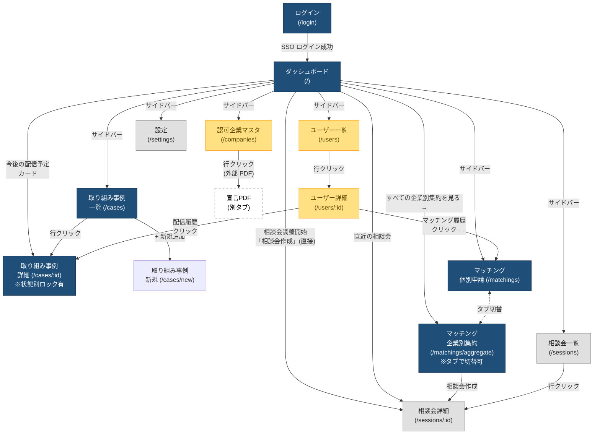
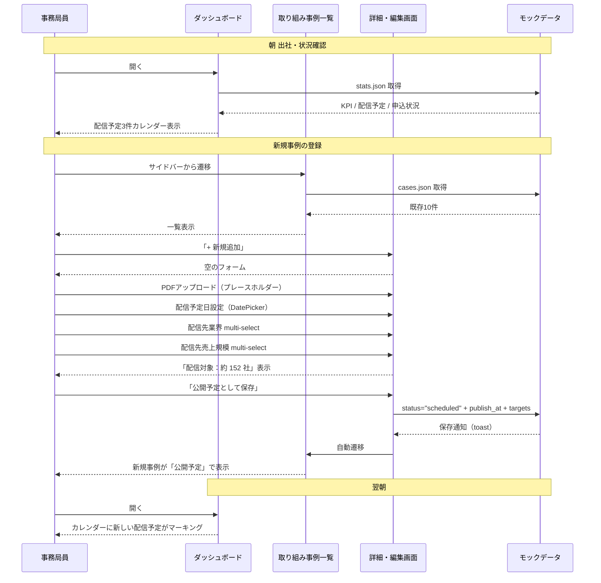
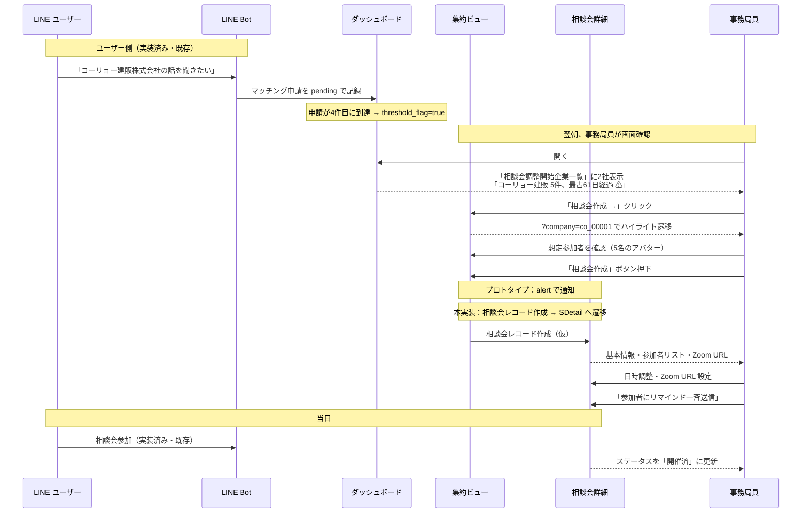
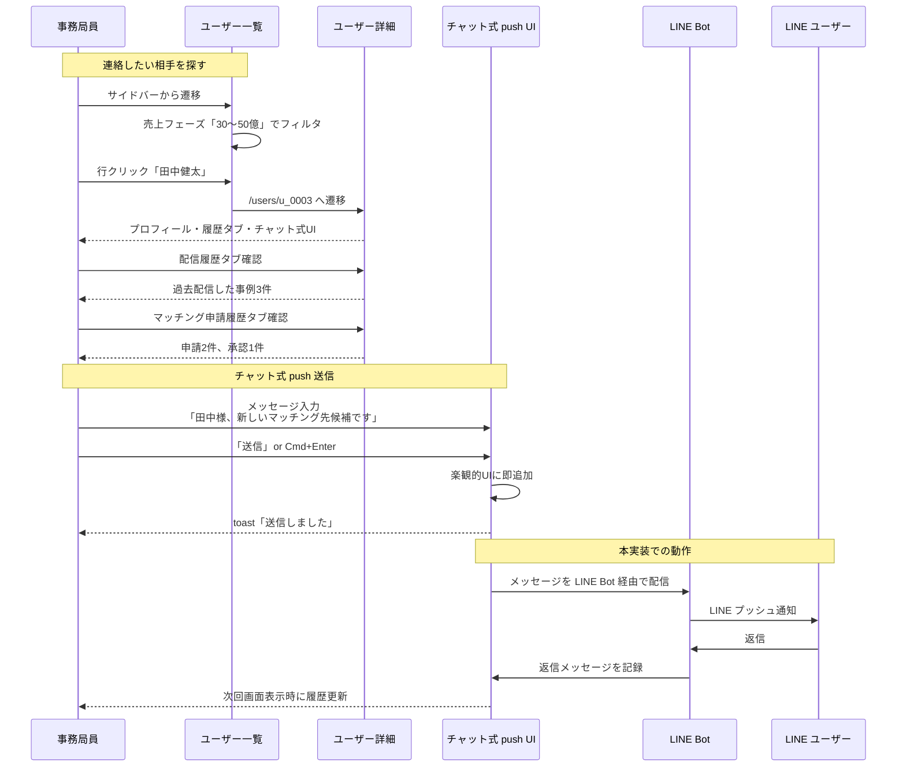
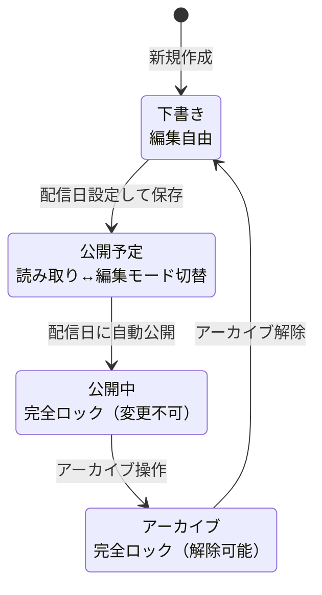
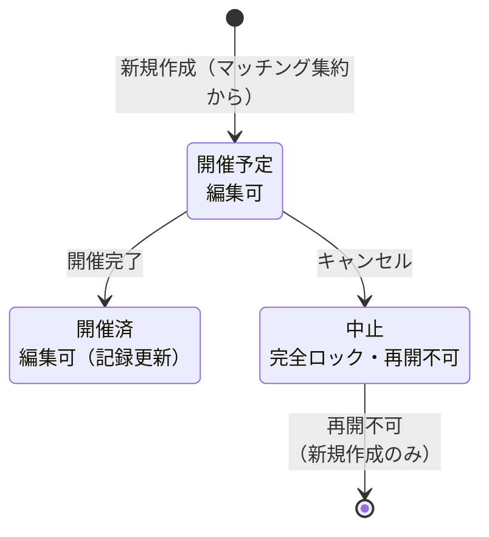

# 画面遷移図｜YNMO 100億宣言支援AI 管理コンソール

主要3フローの画面遷移を Mermaid で記述。VSCode の Markdown プレビューで図として表示されます。

---

## 全体ナビゲーション



凡例：
- 🔵 紺：優先度A（必須納品）
- 🟡 黄：優先度B（時間内対応）
- ⚪ 灰：優先度C（次フェーズ推奨）
- ⬜ 点線：外部リンク（別タブ）

---

## フロー1：取り組み事例レビュー

事務局員が、新しい事例（外部で作成した PDF）を配信予定として設定する流れ。



---

## フロー2：相談会作成（マッチングしきい値到達）

マッチング申請が4件以上集まった企業について、事務局員が相談会を企画する流れ。



---

## フロー3：個別ユーザーへの連絡

特定のユーザーに対して、事務局員が個別に連絡を送る流れ。



---

## URL クエリパラメータ規約

| URL | クエリ | 用途 |
|---|---|---|
| `/cases` | `?status=scheduled` | ステータス絞込で初期表示 |
| `/matchings/aggregate` | `?company=co_xxxxx` | 特定企業のハイライト |
| `/sessions/new` | `?company=co_xxxxx&from=dashboard` | 企業を pre-fill、キャンセル戻り先を制御 |
| `/sessions/new` | `?from=aggregate` | 集約ビューから新規作成、キャンセルで戻る |
| `/users` | `?phase=04` | 売上フェーズで絞込 |
| `/companies` | `?industry=製造業&prefecture=東京都` | 業種・地域で絞込 |

### キャンセル戻り先制御

`?from=` パラメータで遷移元を記録し、キャンセル時に適切な画面へ戻る：
- `?from=dashboard` → ダッシュボードへ戻る
- `?from=aggregate` → 企業別集約ビューへ戻る
- 指定なし → 該当一覧画面へ戻る

---

## 状態別ロックの遷移

### 取り組み事例の状態遷移



### 相談会の状態遷移



---

## サイドバー構造

```
[ロゴ + ユーザープロフィール]
─────────────────────────
■ メイン
  📊 ダッシュボード
  📄 取り組み事例
  🤝 マッチング申請

■ 運用管理
  📅 相談会
  👤 ユーザー
  🏢 認可企業マスタ

■ システム
  ⚙️ 設定
─────────────────────────
[ログアウト]
```

サイドバーは `/login` でのみ非表示（ConditionalLayout で制御）。
